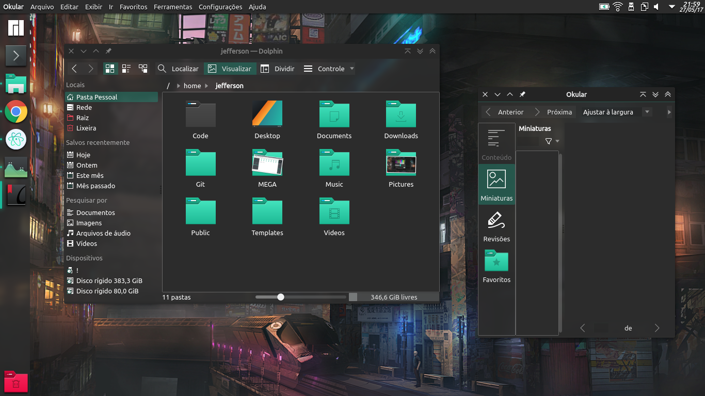

### This is a modified version of the old Papirus theme for the Kvantum engine...
#### All thanks to [varlesh (Alexey Varfolomeev)](https://github.com/varlesh) the creator of Papirus...
#
#### This is a good theme to use with the Breath icons (the Manjaro KDE edition default icons)

